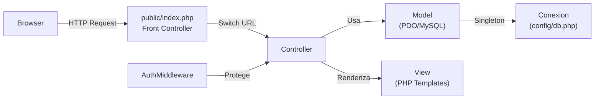
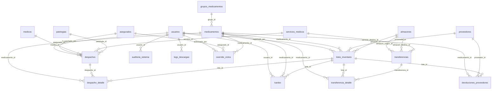
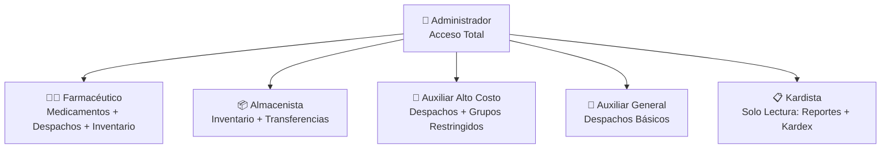
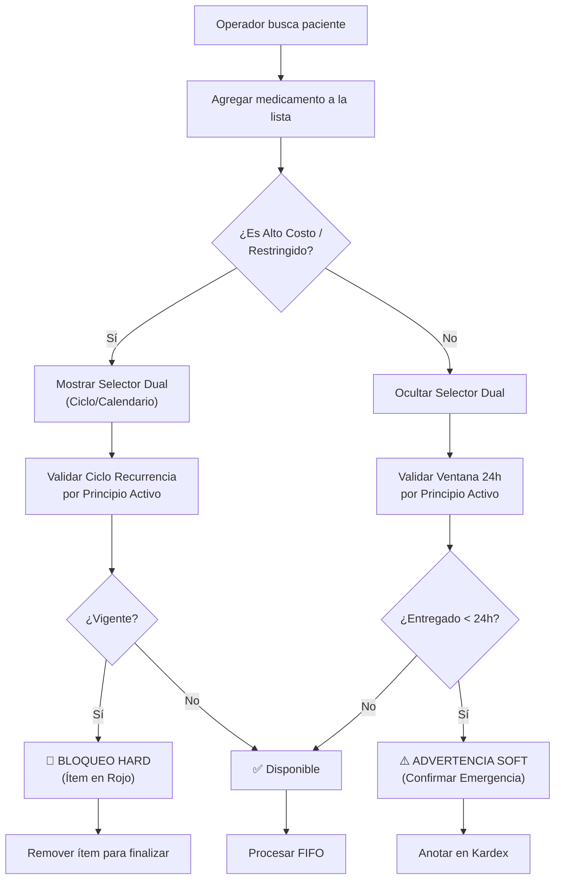

# 🏥 SIGFA V2 — Documentación Técnica Completa

> **Sistema de Gestión Farmacéutica**
> Hospital General Municipal "Dr. Juan Daza Pereyra" — Barquisimeto, Venezuela
> Proyecto Socio Tecnológico II — PNFI / UPTAEB

---

## 📋 Metadata

| Campo | Valor |
|---|---|
| **Proyecto** | SIGFA V2 (Sistema de Gestión Farmacéutica) |
| **Versión** | 2.0 |
| **Repositorio** | `SIGFA_V2-main` |
| **Última revisión** | 2026-05-14 |
| **Equipo** | Gilmer González, Sandy Oviedo, Alirio Colmenares |
| **Institución** | UPTAEB (Universidad Politécnica Territorial Andrés Eloy Blanco) |

---

## 🛠️ Stack Tecnológico

```yaml
Backend:     PHP 8.2 (OOP estricto, type hints)
Frontend:    Vanilla JS + CSS (Rich Aesthetics)
Base Datos:  MySQL / MariaDB (PDO con principios activos)
Arquitectura: MVC (Modelo-Vista-Controlador) personalizado
Servidor:    XAMPP (Apache + MySQL local)
PDF:         DomPDF v3.1 (vía Composer)
Diseño UI:   Glassmorphism + Premium Aesthetics
Fuente:      Outfit / Inter (Google Fonts)
```

---

## 🏗️ Arquitectura del Proyecto

### Estructura de Directorios

```
SIGFA_V2-main/
├── app/
│   ├── controllers/        # 14 controladores
│   │   ├── AjaxController.php
│   │   ├── AlmacenController.php
│   │   ├── AuthController.php
│   │   ├── BackupController.php
│   │   ├── DashboardController.php
│   │   ├── DespachoController.php
│   │   ├── DevolucionController.php
│   │   ├── GrupoController.php
│   │   ├── InventarioController.php
│   │   ├── ModuloController.php
│   │   ├── PatologiaController.php
│   │   ├── ReporteController.php
│   │   ├── ServicioController.php
│   │   └── TransferenciaController.php
│   ├── models/             # 15 modelos
│   │   ├── Almacen.php
│   │   ├── Asegurado.php
│   │   ├── Backup.php
│   │   ├── Despacho.php
│   │   ├── Devolucion.php
│   │   ├── GrupoMedicamento.php
│   │   ├── Inventario.php
│   │   ├── Medicamento.php
│   │   ├── Medico.php
│   │   ├── Patologia.php
│   │   ├── Proveedor.php
│   │   ├── Reporte.php
│   │   ├── ServicioMedico.php
│   │   ├── Transferencia.php
│   │   └── Usuario.php
│   ├── views/              # 18 carpetas de vistas
│   │   ├── almacenes/
│   │   ├── asegurados/
│   │   ├── auth/           # login.php
│   │   ├── backup/
│   │   ├── dashboard/      # index.php (panel principal)
│   │   ├── despachos/      # index.php, nuevo.php, anulaciones.php
│   │   ├── devoluciones/
│   │   ├── grupos/
│   │   ├── inventario/     # entrada.php, alertas.php, kardex.php, ajuste.php
│   │   ├── layouts/        # header.php (41KB), footer.php
│   │   ├── medicamentos/
│   │   ├── medicos/
│   │   ├── patologias/
│   │   ├── proveedores/
│   │   ├── reportes/       # 13 sub-vistas de reportes
│   │   ├── servicios/
│   │   ├── transferencias/
│   │   └── usuarios/
│   ├── middleware/
│   │   └── AuthMiddleware.php
│   └── cron/
│       └── backup_semanal.php
├── config/
│   └── db.php              # Conexión PDO Singleton
├── database/
│   └── schema.sql          # Esquema completo (20 tablas)
├── public/
│   └── index.php           # Front Controller (punto de entrada único)
├── vendor/                 # Dependencias Composer (DomPDF)
├── screenshots/            # 11 capturas de pantalla del sistema
├── composer.json
└── README.md
```

### Patrón Arquitectónico



> [!IMPORTANT]
> El sistema usa un **Front Controller** centralizado en `public/index.php` que enruta todas las peticiones mediante un `switch` sobre `$_GET['url']`. No usa framework externo ni autoloading PSR-4.

---

## 🗄️ Base de Datos — Esquema Completo

### Configuración de Conexión

```php
// config/db.php
DB_HOST    = 'localhost'
DB_PORT    = '3306'
DB_NAME    = 'sigfa_db'
DB_USER    = 'root'
DB_PASS    = ''
DB_CHARSET = 'utf8mb4'
```

- **Patrón Singleton** para la conexión PDO (`Conexion::obtenerInstancia()`)
- Métodos de conveniencia: `ejecutar()`, `iniciarTransaccion()`, `confirmar()`, `revertir()`, `ultimoId()`

### Diagrama Entidad-Relación (20 Tablas)



### Tablas Detalladas

#### 1. `usuarios`
| Columna | Tipo | Notas |
|---|---|---|
| id | INT UNSIGNED PK | Auto-incremental |
| cedula | VARCHAR(12) UNIQUE | Ej: `V-00000001` |
| nombre / apellido | VARCHAR(80) | — |
| correo | VARCHAR(150) UNIQUE | — |
| telefono | VARCHAR(20) | Nullable |
| clave | VARCHAR(255) | Bcrypt hash (`password_hash`) |
| rol | ENUM | `Administrador`, `Auxiliar_General`, `Auxiliar_Alto_Costo`, `Almacenista`, `Farmaceutico`, `Kardista` |
| activo | TINYINT(1) | Default 1 |
| ultimo_acceso | DATETIME | Se actualiza en login |

#### 2. `asegurados`
| Columna | Tipo | Notas |
|---|---|---|
| id | INT UNSIGNED PK | — |
| cedula | VARCHAR(12) UNIQUE | Nullable (para menores sin cédula) |
| nombre / apellido | VARCHAR(80) | — |
| fecha_nacimiento | DATE | Para cálculo automático de edad |
| sexo | ENUM('M','F') | — |
| grupo_sanguineo | ENUM | 8 tipos (A+, A-, B+, B-, AB+, AB-, O+, O-) |
| historia_medica | VARCHAR(30) UNIQUE | — |
| partida_nacimiento | VARCHAR(50) UNIQUE | Para menores sin cédula |
| estado / municipio / parroquia | VARCHAR | Ubicación geográfica |
| tipo_asegurado | ENUM | `Titular`, `Beneficiario`, `Paciente` |
| estatus | ENUM | `Activo`, `Inactivo`, `Anulado`, `Fallecido` |
| ciclo_tratamiento | TINYINT(1) | Default 21 días |
| datos_actualizados | TINYINT(1) | Flag de actualización |

#### 3. `medicos`
| Columna | Tipo | Notas |
|---|---|---|
| cedula | VARCHAR(12) UNIQUE | — |
| codigo_mpps | VARCHAR(30) UNIQUE | Código del Ministerio de Salud |
| especialidad | VARCHAR(100) | — |

#### 4. `grupos_medicamentos`
| Columna | Tipo | Notas |
|---|---|---|
| codigo | VARCHAR(10) UNIQUE | Ej: `001` a `008` |
| nombre | VARCHAR(150) | — |

**Datos iniciales:**
- `001` Inyectables
- `002` Patentados
- `003` Estupefacientes ⚠️ (restringido)
- `004` Psicotrópicos ⚠️ (restringido)
- `005` Enfermedades crónicas ⚠️ (restringido)
- `006` Sin código
- `007` Misceláneos
- `008` Otros

> [!WARNING]
> Los grupos `003`, `004`, `005` son **RESTRINGIDOS**. Solo Auxiliar_Alto_Costo, Farmacéutico y Administrador pueden despachar medicamentos de estos grupos.

| 5. `medicamentos`
| Columna | Tipo | Notas |
|---|---|---|
| codigo | VARCHAR(30) UNIQUE | — |
| nombre_generico | VARCHAR(150) | — |
| id_principio_activo | FK → principios_activos | **Nuevo: Validación cruzada** |
| nombre_comercial | VARCHAR(150) | Nullable |
| concentracion | VARCHAR(50) | — |
| tipo | ENUM | 11 tipos (Tableta, Cápsula, Jarabe, Inyectable, etc.) |
| presentacion | VARCHAR(100) | — |
| grupo_id | FK → grupos_medicamentos | — |
| tipo_medicamento | ENUM | `General`, `Alto_Costo` |
| stock_minimo | INT UNSIGNED | Default 10 |

#### 5.1 `principios_activos`
| Columna | Tipo | Notas |
|---|---|---|
| id | INT UNSIGNED PK | — |
| nombre | VARCHAR(100) UNIQUE | Ej: "Paracetamol", "Insulina" |

#### 6. `proveedores`
- RIF único, razón social, datos de contacto

#### 7. `almacenes`
- Código y nombre únicos, tipo (General por defecto), ubicación

#### 8. `servicios_medicos`
- Código opcional, nombre, descripción

#### 9. `patologias`
- Nombre, clasificación, grupo etario, código CIE-10

#### 10. `lotes_inventario` ⭐ (Tabla crítica)
| Columna | Tipo | Notas |
|---|---|---|
| medicamento_id | FK → medicamentos | — |
| almacen_id | FK → almacenes | — |
| proveedor_id | FK → proveedores | Nullable |
| numero_lote | VARCHAR(50) | UNIQUE con medicamento_id |
| fecha_fabricacion | DATE | Nullable |
| fecha_vencimiento | DATE | **Clave para FIFO** |
| cantidad_recibida | INT UNSIGNED | Stock original |
| cantidad_disponible | INT UNSIGNED | Stock actual |
| precio_unitario | DECIMAL(10,2) | — |
| numero_guia | VARCHAR(50) | Guía de despacho del proveedor |
| chofer_nombre/cedula/telefono/correo | — | Datos del transportista |
| placa_vehiculo | VARCHAR(20) | — |
| estatus | ENUM | `Disponible`, `Agotado`, `Vencido`, `Anulado` |
| registrado_por | FK → usuarios | — |
| anulado_por | FK → usuarios | Para eliminación lógica |
| motivo_anulacion | TEXT | — |

#### 11-12. `despachos` + `despacho_detalle`
| Campo clave (despachos) | Notas |
|---|---|
| uuid | UUID v4 único |
| ticket | Formato: `DSP-YYYYMMDD-####` |
| asegurado_id / medico_id / servicio_id / patologia_id | FKs |
| edad_paciente | Calculada automáticamente |
| monto_total | Suma de precios × cantidades |
| estatus | `Pendiente`, `Despachado`, `Anulado` |
| despachado_por / anulado_por | FK → usuarios |

#### 13-14. `transferencias` + `transferencia_detalle`
- Código: `TRF-YYYYMMDD-####`
- Soporte para Almacén→Almacén y Almacén→Servicio
- Estatus: `Pendiente`, `En_Transito`, `Completada`, `Anulada`

#### 15. `devoluciones_proveedores`
- Número de comprobante único
- Estatus: `Pendiente`, `Aprobada`, `Rechazada`, `Anulada`

#### 16. `kardex` ⭐ (Auditoría de movimientos)
| Columna | Notas |
|---|---|
| tipo_movimiento | `Entrada`, `Salida`, `Ajuste_Positivo`, `Ajuste_Negativo`, `Anulacion`, `Devolucion` |
| cantidad | Positivo o negativo |
| stock_anterior / stock_posterior | Trazabilidad completa |
| referencia_tipo / referencia_id | Polimórfico (despacho, lote, ajuste, etc.) |
| ip_address / session_id / user_agent | Datos forenses |

#### 17. `alertas`
- Tipos: Vencimiento, etc.
- Niveles: `Info`, `Advertencia`, `Critico`
- Auto-generadas cuando un lote vence en < 30 días

#### 18. `override_ciclos`
- Permite saltar el bloqueo de 21 días con autorización

#### 19. `auditoria_sistema`
- Registro de acciones por módulo (usuario, acción, detalle, IP)

#### 20. `logs_descargas`
- Registro de exportaciones PDF/Excel con usuario y timestamp

---

## 👥 Sistema de Roles y Permisos

### Roles Definidos (6)



### Matriz de Permisos por Módulo

| Módulo | Admin | Farmacéutico | Almacenista | Aux. Alto Costo | Aux. General | Kardista |
|---|:---:|:---:|:---:|:---:|:---:|:---:|
| Dashboard | ✅ | ✅ | ✅ | ✅ | ✅ | ✅ |
| Usuarios | ✅ | ❌ | ❌ | ❌ | ❌ | ❌ |
| Asegurados | ✅ | ❌ | ❌ | ✅ | ✅ | ❌ |
| Médicos | ✅ | ❌ | ❌ | ✅ | ✅ | ❌ |
| Medicamentos | ✅ | ✅ | ❌ | ✅ | ✅ | ❌ |
| Grupos Med. | ✅ | ✅ | ❌ | ❌ | ❌ | ❌ |
| Proveedores | ✅ | ✅ | ✅ | ✅ | ✅ | ❌ |
| Almacenes | ✅ | ✅ | ✅ | ❌ | ❌ | ❌ |
| Servicios | ✅ | ✅ | ✅ | ✅ | ✅ | ❌ |
| Patologías | ✅ | ✅ | ✅ | ✅ | ✅ | ❌ |
| Inventario | ✅ | ✅ | ✅ | ✅ | ✅ | ❌ |
| Despachos | ✅ | ✅ | ❌ | ✅ | ✅ | ❌ |
| Transferencias | ✅ | ✅ | ✅ | ❌ | ❌ | ❌ |
| Devoluciones | ✅ | ✅ | ✅ | ❌ | ❌ | ❌ |
| Reportes | ✅ | ✅ | ✅ | ✅ | ✅ | ✅ |
| Kardex | ✅ | ✅ | ✅ | ✅ | ✅ | ✅ |
| Ajuste Manual | ✅ | ❌ | ❌ | ❌ | ❌ | ❌ |
| Anular Transacciones | ✅ | ❌ | ❌ | ❌ | ❌ | ❌ |

### Permisos Especiales

| Acción | Roles Permitidos |
|---|---|
| Modificar inventario manualmente | Solo Admin |
| Ajustar stock de lotes | Solo Admin |
| Anular transacciones | Solo Admin |
| Gestionar usuarios | Solo Admin |
| Despachar grupos 003/004/005 | Admin, Aux. Alto Costo, Farmacéutico |
| Registrar entradas de inventario | Admin, Almacenista, Farmacéutico |
| Realizar despachos | Admin, Aux. General, Aux. Alto Costo, Farmacéutico |
| Realizar transferencias | Admin, Almacenista, Farmacéutico |

---

## ⚙️ Módulos Funcionales Detallados

### 1. 🔐 Autenticación (`AuthController`)

**Flujo de Login:**
1. Mostrar formulario con token CSRF
2. Auto-formateo de cédula (si es numérico, agrega `V-`)
3. Verificación de credenciales con feedback detallado:
   - `DB_VACIA` → "Ejecute schema.sql"
   - `NO_EXISTE` → "Usuario no registrado"
   - `INACTIVO` → "Cuenta desactivada"
   - `CLAVE_INCORRECTA` → "Contraseña incorrecta"
4. Regeneración de `session_id` (previene session fixation)
5. Almacenamiento en sesión: `usuario_id`, `usuario_nombre`, `usuario_rol`, `usuario_cedula`

**Seguridad implementada:**
- Token CSRF en todos los formularios (`bin2hex(random_bytes(32))`)
- Password hashing con `password_hash()` / `password_verify()` (Bcrypt)
- Session regeneration post-login

### 2. 📊 Dashboard (`DashboardController`)

Métricas en tiempo real:
- Total medicamentos activos
- Despachos del día
- Alertas de vencimiento (no resueltas)
- Lotes con stock bajo
- Lotes próximos a vencer (< 30 días)
- Medicamentos con stock bajo
- Últimos despachos del día

### 3. 💊 Despachos (`DespachoController` + `Despacho.php`) ⭐

**Flujo de Validación por Ítem (Refactorizado):**



**Principios de la Nueva Lógica:**
1. **Validación por Principio Activo:** No se bloquea al paciente globalmente, sino por el componente activo del fármaco entregado anteriormente.
2. **Ciclos Dinámicos:** El operador define cuántos días de tratamiento está entregando (7, 10, 15, 21, 30, 90, 180 o manual).
3. **Cálculo de Próxima Fecha:** `Fecha Disponible = Fecha Despacho + Ciclo Asignado`.
4. **Hard Block vs Soft Warning:**
   - **Meds Comunes:** Aviso informativo (Soft) de 24h.
   - **Meds Alto Costo/Controlados:** Bloqueo obligatorio (Hard) hasta cumplir el ciclo.

**Lógica FIFO (First-In, First-Out):**
```
1. Obtener TODOS los lotes disponibles del medicamento
   ORDER BY fecha_vencimiento ASC, id ASC
2. Descontar del lote más próximo a vencer primero
3. Si un lote no tiene suficiente, continuar con el siguiente
4. Registrar cada descuento individual en el Kardex
```

**Anulación de despachos (Solo Admin):**
1. Verificar que el despacho no esté ya anulado
2. Revertir stock de cada detalle al lote original
3. Registrar devolución en el Kardex
4. Marcar despacho como `Anulado` con motivo y auditoría

### 4. 📦 Inventario (`InventarioController` + `Inventario.php`)

**Operaciones:**
- **Entrada de lotes**: Registro masivo (múltiples medicamentos por operación)
  - Incluye datos logísticos: guía, chofer, cédula, placa
  - Auto-genera alertas si vence en < 30 días
- **Kardex**: Historial completo de movimientos por medicamento
- **Alertas**: Vencimiento (< 30 días) y stock bajo
- **Ajuste manual** (Solo Admin): Modificar cantidad y/o fecha de un lote
- **Anulación de entrada** (Solo Admin): Eliminación lógica con bloqueo si tiene despachos

### 5. 🔄 Transferencias (`TransferenciaController` + `Transferencia.php`)

**Tipos soportados:**
- Almacén → Almacén
- Almacén → Servicio Médico

**Flujo:**
1. Seleccionar origen, destino y medicamentos/lotes
2. Descontar stock del almacén origen
3. Registrar salida en Kardex
4. Código: `TRF-YYYYMMDD-####`

**Anulación**: Revierte stock y registra entrada compensatoria en Kardex

### 6. ↩️ Devoluciones a Proveedores (`DevolucionController`)

- Registro con proveedor, medicamento, lote y motivo
- Generación de comprobante
- Anulación disponible

### 7. 📄 Reportes (`ReporteController`) — 13 Tipos

| # | Reporte | Ruta | Filtros | Exporta |
|---|---|---|---|---|
| 1 | Por Servicio | `reportes/servicio` | Fecha, servicio_id | PDF, Excel |
| 2 | Por Medicamento | `reportes/medicamento` | Fecha, medicamento_id | PDF, Excel |
| 3 | Por Período | `reportes/periodo` | Fecha, paciente, medicamento | PDF, Excel |
| 4 | Consumo en Bolívares | `reportes/consumo` | Fecha | PDF, Excel |
| 5 | Inventario Valorizado | `reportes/inventario` | — | PDF, Excel |
| 6 | Kardex Completo | `reportes/kardex` | medicamento_id | PDF, Excel |
| 7 | Auditoría de Movimientos | `reportes/auditoria` | Fecha, acción, módulo | PDF, Excel |
| 8 | Por Patología | `reportes/patologia` | patologia_id, fecha | PDF, Excel |
| 9 | Prescripción por Paciente | `reportes/paciente` | Cédula, fecha | PDF, Excel |
| 10 | Recetas Diarias | `reportes/recetas` | Fecha | PDF, Excel |
| 11 | Consumo Masivo | `reportes/consumo_masivo` | Fecha, grupo_id | PDF, Excel |
| 12 | Costo Promedio | `reportes/costo_promedio` | Fecha, grupo_id | PDF, Excel |
| 13 | Alertas de Calidad | `reportes/alertas` | — | PDF, Excel |

**Exportación PDF**: DomPDF con membrete institucional (A4 Landscape)
**Exportación Excel**: XML-SpreadsheetML con estilos profesionales

**Detección de anomalías** (Reporte de Prescripción por Paciente):
- Alerta si medicamento despachado con < 15 días de diferencia
- Alerta si medicamento despachado > 3 veces en el período

### 8. 🏢 Módulos CRUD (`ModuloController`)

Gestión completa (crear, listar, editar) para:
- Asegurados/Pacientes
- Medicamentos
- Médicos
- Proveedores (crear, editar, actualizar, eliminar)
- Usuarios

### 9. Módulos de Catálogo

| Módulo | Controller | Operaciones |
|---|---|---|
| Almacenes | `AlmacenController` | CRUD + toggle activo + AJAX |
| Grupos Medicamentos | `GrupoController` | CRUD + toggle + AJAX |
| Servicios Médicos | `ServicioController` | Crear, listar, eliminar + AJAX |
| Patologías | `PatologiaController` | Crear, listar, eliminar |

### 10. 💾 Backup (`BackupController`)

- Crear backup de la base de datos
- Descargar backup
- Eliminar backups antiguos
- Cron semanal: `app/cron/backup_semanal.php`

---

## 🌐 Endpoints API / AJAX

### Búsqueda dinámica (ComboBox)

| Endpoint | Descripción |
|---|---|
| `ajax/medicamentos` | Buscar medicamentos |
| `ajax/pacientes` | Buscar pacientes |
| `ajax/medicos` | Buscar médicos |
| `ajax/proveedores` | Buscar proveedores |
| `ajax/grupos` | Buscar grupos |
| `ajax/almacenes` | Buscar almacenes |
| `ajax/servicios` | Buscar servicios |
| `ajax/patologias` | Buscar patologías |

### APIs específicas

| Endpoint | Método | Descripción |
|---|---|---|
| `api/buscar-paciente` | GET | Buscar paciente por cédula (despachos) |
| `api/verificar-duplicidad` | GET | Verificar si paciente ya tiene despacho hoy |
| `api/verificar-ciclo-dosis` | GET | Verificar bloqueo de recurrencia (21 días) |
| `transferencias/ajaxLotes` | GET | Buscar lotes disponibles para transferencia |
| `devoluciones/ajaxLotes` | GET | Buscar lotes para devolución |

---

## 🔒 Seguridad Implementada

| Mecanismo | Implementación |
|---|---|
| **Hashing contraseñas** | `password_hash()` Bcrypt |
| **CSRF Protection** | Token en sesión, validado en todos los POST |
| **Session Fixation** | `session_regenerate_id(true)` post-login |
| **SQL Injection** | PDO Prepared Statements (`:named` params) |
| **XSS** | `htmlspecialchars()` en vistas, `filter_var()` en URL |
| **Autorización** | Middleware de roles por módulo |
| **Auditoría forense** | IP, session_id, user_agent en Kardex |

---

## 🎨 Diseño Frontend

- **Estilo visual**: Glassmorphism + Minimalismo
- **Framework CSS**: Tailwind CSS
- **Fuente principal**: Outfit (Google Fonts)
- **Responsive**: Sí (diseño adaptable)
- **Página 404**: Custom con gradientes y animación hover
- **Layout**: `header.php` (41KB — UI completa con sidebar) + `footer.php`

---

## ⚠️ Observaciones Técnicas y TODOs

### Issues Identificados

> [!CAUTION]
> **Rutas duplicadas en `index.php`**: Los bloques de rutas `ajax/*` y `proveedores/*` están duplicados en el switch del Front Controller (líneas ~428-466 y ~534-566). Esto no causa error (el primer `case` matcheado gana) pero es código muerto que debe limpiarse.

> [!WARNING]
> **Doble descuento de stock en `Despacho::crearDespacho()`**: El método llama a `$this->inventario->descontarFIFO()` (que ya actualiza `lotes_inventario`) Y luego ejecuta un UPDATE adicional en la línea 280-283. Esto podría causar **descuento doble** de stock. Requiere revisión.

> [!NOTE]
> **`eliminarLote()` referencia tabla inexistente**: En `Inventario.php` línea 487, se consulta `transferencias_almacenes` que no existe en el schema. La tabla correcta es `transferencia_detalle`. Esto causará error SQL si se intenta anular un lote.

### Mejoras Pendientes

- [ ] Implementar autoloading PSR-4 en lugar de `require_once` manual
- [ ] Migrar el router Switch a un sistema de routing más escalable
- [ ] Agregar paginación en listados largos
- [ ] Implementar rate limiting en endpoints AJAX
- [ ] Agregar logs de errores más detallados
- [ ] Implementar tests unitarios
- [ ] Limpiar rutas duplicadas en `index.php`
- [ ] Revisar doble descuento en `crearDespacho()`
- [ ] Corregir referencia a `transferencias_almacenes` → `transferencia_detalle`

---

## 🔑 Credenciales por Defecto

| Campo | Valor |
|---|---|
| **Cédula** | `V-00000001` |
| **Contraseña** | `Admin2026!` |
| **Rol** | Administrador |
| **Correo** | `admin@sigfa.local` |

---

## 📸 Screenshots Disponibles

El proyecto incluye 11 capturas de pantalla en `screenshots/` (archivos `1.png` a `11.png`, ~300KB cada una) que documentan la interfaz del sistema.

---

## 🏷️ Tags

`#SIGFA` `#PHP` `#MySQL` `#MVC` `#Farmacia` `#Hospital` `#UPTAEB` `#PNFI` `#ProyectoSocioTecnologico`
